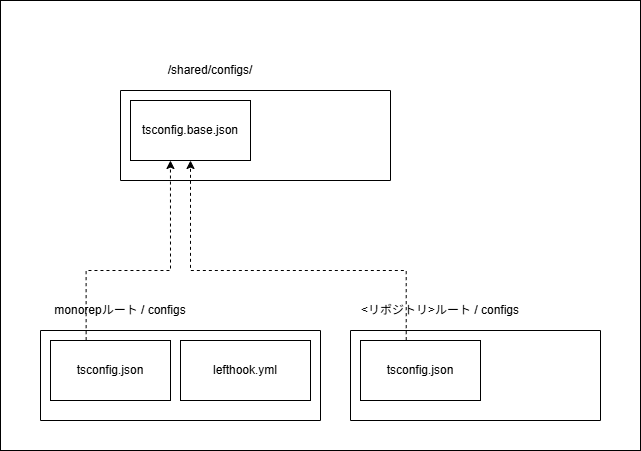

## 7 設定ファイルの共通化と拡張

### 7.1 基本設定ファイルによる設定の共通化

<!--  vale Google.Colons = NO -->

このプロジェクトでは、設定の統一と保守性向上のために基本設定ファイルを `/shared/configs/` ディレクトリにまとめています。

各リポジトリ (monorepo ルートやサブリポジトリ) は、`import` などによってこれらを参照し、独自の要素だけを追加する形で構成しています。

一部のツール (例: Secretlint) のように設定の参照機構を持たない場合は、同期スクリプトによって直接コピーして運用しています。

#### 設定ファイルの構成と参照関係

以下の図に、設定ファイルがどのように基本構成ファイルを参照しているかを図解します。


*[図1-1] 設定ファイルの構成と参照関係*

🔍 図の読み解きポイント:

- `/shared/configs/tsconfig.base.json` は、TypeScript の基本設定ファイルであり、
  `monorepo`ルートや`各サブリポジトリの`tsconfig.json`から`extends`によって参照されます
- `lefthook.yml`は、**他の設定を参照せずに設定する自己完結型の設定ファイル**であり、`/shared/configs/`下に基本設定ファイルはありません
- 一部の設定ファイル (例: `secretlint.config.yaml`)は、同期スクリプト`pnpm run sync:configs`による**同期コピー**によって共通化しています

#### 参照による共通化

通常の設定ファイルは、参照によって設定を共通化しています。
`eslint.config.js`は、`import /shared/configs/eslint.config.base.js`という`import`文で設定を読み込み、自身の設定に反映させています。

#### 同期による共通化

基本設定ファイルを参照できない設定ファイルは、同期スクリプトにより基本設定ファイルの内容を、設定ファイルに同期コピーします。
同期コピーはサブリポジトリ側のファイルを上書きするため、**サブリポジトリ側の変更が反映されず消失する**ことに注意が必要です。

### 7.2 設定ファイルの全体像と分類

設定ファイルの運用は、「どこに配置されるか」と「どのように共通設定を利用するか」の 2 軸で分類されます。

#### 2軸による分類

- 配置軸
  - `/shared/configs` (共通設定ファイル配置用)
  - `<monorepo>` (monorepo ルート)
  - `<monorepo>/configs`
  - `<subrepo>` (サブリポジトリルート)
  - `<subrepo>/configs`

- 機能軸
  - 参照元 (共通設定ファイル)
  - 拡張参照 (共通設定ファイルを参照して拡張)
  - 同期コピー (共通設定ファイルを同期して使用)
  - 独立設定 (共通設定ファイルと関係なくて設定)

#### 設定ファイルの分類表

設定ファイルを上記の 2 軸で分類すると、下記の表となります:

<!--markdownlint-disable no-emphasis-as-heading --><!--　markdownlint-disable line-length -->

| 機能\配置  | `/shared/configs`        | `<monorepo>` (monorepoルート) | `<monorepo>/configs`                | `<subrepo>` サブリポジトリルート | `<subrepo>/configs`              |
| ---------- | ------------------------ | ----------------------------- | ----------------------------------- | -------------------------------- | -------------------------------- |
| 参照元     | eslint.config.base.js 等 | -                             | -                                   | -                                | -                                |
| 拡張参照   | -                        | tsconfig.json                 | vitest.config.ci.ts                 | tsconfig.json                    | eslint.config.js, tsup.config.ts |
| 同期コピー | -                        | -                             | secretlint.config.yaml              | -                                | secretlint.config.yaml           |
| 独立設定   | -                        | lefthook.yml, dprint.jsonc    | textlintrc.yaml, .markdownlint.yaml |                                  |                                  |

*[表2-1] 設定ファイルの分類表*

<!-- markdownlint-enable  -->

### 7.3 共通設定ファイル (`/shared/config`)

このプロジェクトでは、設定の重複を排除しメンテナンス性を高めるために、共通設定ファイルを `/shared/configs/` に集約しています。
これらのファイルは、主に `import` や `extends` によって各サブリポジトリおよび monorepo ルートの設定ファイルから参照され、共通のルールやオプションを提供します。

設定ファイルは以下のように分類され、それぞれが特定の用途に特化しています。

- **静的解析ツール** (ESLint、Secretlint)
- **テストフレームワーク** (Vitest)
- **ビルドツール** (tsup)
- **TypeScript コンパイラ設定** (tsconfig)
- **その他ユーティリティ設定** (base-scripts.json など)

共通設定ファイルを基に、各リポジトリで必要な設定だけを上書き・拡張しています。
これにより、各リポジトリで柔軟な調整を可能にしつつ、設定の統一と保守性を確保しています。

主なファイルの概要は以下のとおりです。

<!-- markdownlint-disable line-length -->

| ファイル名                    | 概要                                           | 備考                                         |
| ----------------------------- | ---------------------------------------------- | -------------------------------------------- |
| `base-scripts.json`           | `package.json` の `scripts` セクション共通定義 | サブパッケージにコピーしてスクリプトを統一   |
| `commitlint.config.base.ts`   | commitlint の基本ルール                        | コミットメッセージをルールに従って検証       |
| `eslint.config.base.js`       | ESLint の標準設定                              | JavaScript / TypeScript の静的解析の出発点   |
| `eslint.config.typed.base.js` | 型チェック用 ESLint 拡張設定                   | 型に関連するルールのみを追加定義             |
| `eslint.rules.typed.js`       | 型チェック向け ESLint ルール群                 | FlatConfig の各エントリに適用するルール定義  |
| `secretlint.config.base.yaml` | Secretlint の共通ルール                        | 同期コマンドでコピーし、各リポジトリで利用   |
| `tsconfig.base.json`          | TypeScript コンパイラの基本オプション定義      | `target` や `module` 等の共通化              |
| `tsup.config.base.ts`         | tsup ビルド設定のベースファイル                | CJS/ESM 両対応ビルドの前提設定               |
| `vitest.config.base.ts`       | Vitest テスト設定の共通定義                    | ユニット・統合テストいずれにも共通で使用可能 |

*[表3-1] 共通設定ファイルとその概要*<!-- markdownlint-enable -->

これらの設定ファイルはプロジェクト内で再利用性を高め、各種ツールの導入と運用コストを最小化するための基盤として機能します。

### 7.4 サブリポジトリにおける設定ファイル

サブリポジトリでは、ESLint や tsup など複数のツールに対応する設定ファイルを、それぞれの用途に応じて運用しています。
これらの設定は、用途に応じてルート直下と configs ディレクトリに分けて配置されます。

- `<subrepo>/` (ルート直下)
  → `package.json`や TypeScript などの、パッケージのルートに直接影響する設定ファイル

- `<subrepo>/configs/` (設定ディレクトリ)
  → ESLint、tsup、Vitest などのツール固有設定ファイルを集約し、管理

多くの設定ファイルは `/shared/configs/` の共通設定ファイルをベースにしており、主に `import` や `extends` によって拡張する形式をとっています。

#### ルート直下の設定ファイル

| ファイル名      | 用途                    | 補足                                        |
| --------------- | ----------------------- | ------------------------------------------- |
| `tsconfig.json` | TypeScript のルート設定 | `/shared/configs/tsconfig.base.json` を継承 |

*[表4-1] ルート直下の設定ファイルと概要*

#### `<subrepo>/configs/` 配下の設定ファイル

<!-- markdownlint-disable line-length -->

| ファイル名               | ツール     | 概要                                                  | 参照元ファイル名              | 参照方式 | 備考                                         |
| ------------------------ | ---------- | ----------------------------------------------------- | ----------------------------- | -------- | -------------------------------------------- |
| `commitlint.config.ts`   | commitlint | コミットメッセージを `Conventional Commit` 形式で検証 | `commitlint.config.base.ts`   | 参照     | 独自ルールの追加が可能                       |
| `eslint.config.js`       | ESLint     | TypeScript 用の静的解析設定                           | `eslint.config.base.js`       | 参照     | ソース構成に応じた `resolver` を個別指定     |
| `eslint.config.typed.js` | ESLint     | 型チェックを強化した設定                              | `eslint.rules.typed.js`       | 参照     | `parserOptions.project` の指定が必要         |
| `secretlint.config.yaml` | Secretlint | 機密情報の検出ルール設定                              | `secretlint.config.base.yaml` | 同期     | 編集不可、同期スクリプトで上書きされる       |
| `tsup.config.ts`         | tsup       | CommonJS 出力用のビルド設定                           | `tsup.config.base.ts`         | 参照     | 汎用的なビルド設定                           |
| `tsup.config.module.ts`  | tsup       | ESM 出力 + 型定義ファイル (`index.d.ts`) 用設定       | `tsup.config.base.ts`         | 参照     | エクスポート形式の変更や型出力に対応         |
| `vitest.config.unit.ts`  | Vitest     | ユニットテスト用設定 (`src/` 配下)                    | `vitest.config.base.ts`       | 参照     | 関数レベルの小規模テストに適する             |
| `vitest.config.ci.ts`    | Vitest     | 統合テスト・CI 用設定 (`tests/` 配下)                 | `vitest.config.base.ts`       | 参照     | サービス結合や CI 用のインテグレーション向け |

*[表4-2] `configs/下`の設定ファイルと概要*<!-- markdownlint-enable -->

#### 拡張設定の具体例

たとえば、`eslint.config.js` では次のように共通設定を読み込みつつ、固有の調整を加えています。

```js
import baseConfig from '../../../../shared/configs/eslint.config.base.js';

export default [
  ...baseConfig,
  {
    files: ['src/**/*.ts'],
    settings: {
      // TypeScript プロジェクトのパスを指定し、import 解決の精度を高める設定
      'import/resolver': {
        typescript: {
          project: './tsconfig.json',
        },
      },
    },
  },
];
```

このように、共通設定 (`baseConfig`) を展開したうえで、対象ファイルや TypeScript 設定を上書きしています。
これにより、各サブリポジトリが自身の構造に合わせたルールを適用しつつ、基本方針は全体で統一されています。

#### 同期によるコピー運用 (例: Secretlint)

Secretlint は `import` などによる設定の参照をサポートしていません。
そのため、共通設定ファイル (`secretlint.config.base.yaml`) を同期スクリプト (例: `pnpm run sync:configs`) で各設定ファイルにコピーしています。

```powershell
pnpm run sync:configs secretlint
```

> この操作により、サブリポジトリの secretlint.config.yaml は強制的に上書きされます。手動編集は失われるため、
> 基本設定の更新は `/shared/configs/` 側で行う必要があります。

### 7.5 `monorepo`の設定ファイル

このプロジェクトでは、ルート直下と専用の設定ディレクトリ `/configs/` に複数の設定ファイルが配置されています。
これらの設定ファイルは、プロジェクト全体に影響するため、全体管理・一元設定の観点から整理されています。

#### 配置場所ごとの特徴

| ディレクトリ          | 用途の概要                               | 備考                                |
| --------------------- | ---------------------------------------- | ----------------------------------- |
| `<monorepo>/`         | プロジェクト全体で使用される設定         | `lefthook.yml`、`tsconfig.json`など |
| `<monorepo>/configs/` | プロジェクト全体を対象とするツールの設定 | 多くは `/shared/configs/` を参照    |

*[表5-1] 配置場所ごとの特徴*

#### `<monorepo>`ルートの設定ファイル

| ファイル名      | ツール     | 用途                    | 備考                        |
| --------------- | ---------- | ----------------------- | --------------------------- |
| `lefthook.yml`  | lefthook   | Gitフックマネージャー　 |                             |
| `dprint.jsonc`  | dprint     | コード／文章整形        |                             |
| `tsconfig.json` | TypeScript |                         | `tsconfig.base.json'`を継承 |

*[表5-2] `<monorepo>`ルートの設定ファイル*

#### `<monorepo>/configs`の設定ファイル (`/shared/configs`参照)

<!-- markdownlint-disable line-length -->

| ファイル名               | ツール     | 用途                                                | 備考                                 |
| ------------------------ | ---------- | --------------------------------------------------- | ------------------------------------ |
| `commitlint.config.ts`   | commitlint | コミットメッセージの形式検証                        | Conventional Commit 形式に準拠       |
| `eslint.config.js`       | ESLint     | JavaScript/TypeScript の静的解析設定                | プロジェクト共通の基本設定           |
| `eslint.config.types.js` | ESLint     | 型の静的解析設定                                    | 型関連ルールの静的解析設定           |
| `eslint.project.js`      | ESLint     | ESLint が解析対象とする `tsconfig` プロジェクト一覧 | 　ルールを適用するプロジェクト設定用 |
| `secretlint.config.yaml` | secretlint | 機密情報検出ルール設定                              |                                      |

*[表5-3] `<monorepo>/configs/`下の設定ファイル*<!-- markdownlint-enable -->

#### `<monorepo>/configs`の設定ファイル (独立設定)

<!-- markdownlint-disable line-length -->

| ファイル名            | ツール       | 用途                                         | 備考                                   |
| --------------------- | ------------ | -------------------------------------------- | -------------------------------------- |
| `codegpt.config.yaml` | CodeGPT      | AIアシスタント (CodeGPT) の設定              | コミットメッセージ自動作成用           |
| `gitleaks.toml`       | Gitleaks     | 機密情報検出設定                             | コードリポジトリ内の機密情報を検出     |
| `ls-lint.yaml`        | ls-lint      | ファイル名形式チェック                       |                                        |
| `textlintrc.yaml`     | textlint     | テキストファイルの文法・スタイルチェック設定 | ドキュメントやマークダウンの品質維持   |
| `.markdownlint.yaml`  | markdownlint | Markdownファイルの文法チェック設定           | Markdown書式の一貫性を保つためのルール |

*[表5-4] `<monorepo>/configs/`下の独立設定ファイル*

<!-- markdownlint-enable -->

これらのファイルは、monorepo 全体の整合性と柔軟なツール設定を両立するための基盤を形成しています。

### 7.6 チェックポイント

設定ファイルを共通化し、拡張して運用する際には、以下のポイントを確認します。

- **共通設定の適用範囲確認**:
  すべてのサブリポジトリやモノレポルートが最新の共通設定を正しく参照しているかを確認する
  特に参照パスの誤りやバージョン不整合に注意

- **同期コピー運用の注意点**:
  同期対象のファイル (例: `secretlint.config.yaml`) は、必ず、共通設定側のファイルを編集し、同期をかける運用ルールを徹底する

- **自己完結型設定ファイルの妥当性確認**
  自己完結型の設定ファイルがプロジェクト構成に適合しているか、依存関係が不要なことを確認

- **拡張設定のテスト実施**:
  拡張設定が意図通り動作するか、CI やローカル環境で必ず検証する

- **ドキュメント・運用ルールの整備**:
  設定ファイルの更新方法や同期スクリプトの使い方など、チーム全体で共有するドキュメントを用意する

これらをチェックしながら運用することで、設定ファイルの統一と拡張のバランスが取れ、メンテナンス性が向上します。

### 7.7 `monorepo`設定ファイル共通化の理解のためのチェックリスト

`monorepo`における設定ファイルの共通化と拡張を効果的に運用するため、以下のポイントを確認してください。

- [ ] **共通設定ファイルが正しく配置されていることを確認する**
      `/shared/configs/` に必要な共通設定ファイルが揃っているか

- [ ] **参照設定の整合性**
      各リポジトリの設定ファイルが正しく共通設定を `import` や `extends` で参照しているか

- [ ] **同期コピーの運用ルールの周知**
      `secretlint.config.yaml` などの編集禁止ファイルの管理ルールが周知されているか

- [ ] **設定変更時の影響範囲の把握**
      共通設定の変更がどのサブリポジトリに影響するか把握し、必要なテストやレビューをしているか

- [ ] **CI/CD パイプラインでの検証**
      設定ファイルの変更がビルドやテストに悪影響を及ぼしていないかを CI で確認しているか

- [ ] **ドキュメントの整備と更新**
      設定ファイル管理や同期手順に関するドキュメントを整備し、常に最新の状態に保っているか

- [ ] **チーム全体への共有と教育**
      新旧メンバーに共通設定の使い方や運用ルールを周知徹底しているか

このチェックリストを活用することで、`monorepo`環境における設定ファイル管理の品質を保ち、効率的な開発運用が可能になります。
