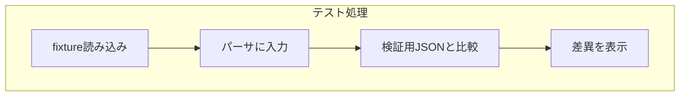

## 2. フレームワークの概要

この章では、E2E Fixture Framework の全体像と構成要素について解説します。

---

### 🎯 目的

E2E Fixture Framework は、**ファイルベースの入力／出力によるE2Eテストを簡潔に記述できる仕組み**を提供します。
主に Markdown や PlainText など、**構造化テキストの解析処理を対象としたテスト**に最適です。

---

### 🏗 主な構成要素

#### 1. `AgE2eFixtureFramework`

- 各 fixture ケースを走査し、テストとして実行するランナー
- `run()` で `input` → `actual` → `expected` の比較を実施

#### 2. `AgE2eTestDiscovery`

- テストケースをファイルシステムから走査・読み取り
- `AgE2eScanFlatTests`, `AgE2eScanCategorizedTests` など

#### 3. `validators`

- 出力の型ごとに検証を行う関数群
  - `validateMarkdownResult`
  - `validatePlaintextResult` など

---

### 📂 テストの構造

```
fixtures/
  ├─ heading/
  │   ├─ input.md
  │   └─ output.json
  └─ multiline/
      ├─ input.txt
      └─ output.json
```

- `input.*`：MarkdownやPlainTextなどの入力ファイル
- `output.json`：解析結果に期待される構造をJSONで記述

---

### ⚙ 実行フロー概要



---

### 📦 拡張性と方針

- バリデータは関数として差し替え可能
- `input/output` 以外の補助ファイルも追加可能（任意拡張）
- 今後は `custom comparator`, `HTML snapshot` なども視野に
