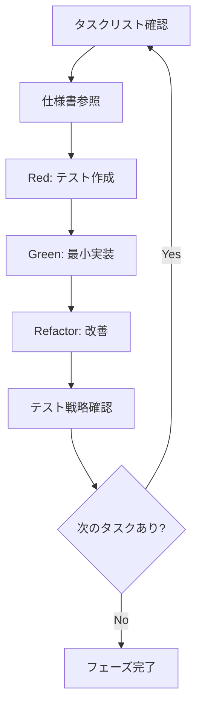

---
header:
- src: README.ja.md
- @(#): ag-logger 関数型リファクタリング ドキュメント
title: ag-logger 純関数設計仕様書
description: ag-loggerパッケージを現代的な関数型プログラミングパターンを用いてリファクタリングする仕様書
version: 1.0.0
created: 2025-07-22
updated: 2025-07-22
authors:
  - atsushifx
changes:
  - 2025-07-22: 初回作成（ドキュメント整備）
copyright:
  - Copyright (c) 2025 atsushifx <https://github.com/atsushifx>
  - This software is released under the MIT License.
  - https://opensource.org/licenses/MIT
---

## 📖 ドキュメント索引

このディレクトリには、ag-loggerを関数型プログラミングパターンでリファクタリングするための包括的なドキュメントが含まれています。

### 📋 主要ドキュメント

| ドキュメント                                                           | 目的                                | 対象読者           |
| ---------------------------------------------------------------------- | ----------------------------------- | ------------------ |
| **[functional-refactoring.spec.md](./functional-refactoring.spec.md)** | 📈 メイン仕様書・アーキテクチャ設計 | 設計者・開発者     |
| **[refactoring.tasks.md](./refactoring.tasks.md)**                     | ✅ t-wada式TDDタスクリスト          | 実装者・進捗管理者 |
| **[pure-functions.spec.md](./pure-functions.spec.md)**                 | 🔧 純関数の詳細設計仕様             | 実装者・レビュアー |
| **[immutable-config.spec.md](./immutable-config.spec.md)**             | ⚙️ 設定管理システム仕様              | 実装者・設定管理者 |
| **[testing-strategy.spec.md](./testing-strategy.spec.md)**             | 🧪 テスト戦略・TDD実行手順          | テスト担当者・QA   |

---

## 🚀 クイックスタート

### MCP経由でのドキュメント参照

1. **Claude Desktop設定確認**
   ```bash
   # .claude/claude_desktop_config.json が存在することを確認
   cat .claude/claude_desktop_config.json
   ```

2. **Claude Desktop再起動**
   - アプリケーションを完全に終了
   - 再起動してMCP設定を反映

3. **ドキュメント参照例**
   ```
   "docs/refactoring.tasks.mdからPhase 1のタスク1を確認して"
   "pure-functions.spec.mdのformatLogMessage仕様を読んで"
   "testing-strategy.spec.mdのRed-Green-Refactorサイクルを参照して"
   ```

### 開発ワークフロー



---

## 📚 ドキュメント詳細ガイド

### 1. functional-refactoring.spec.md

**現在のアーキテクチャから関数型パターンへの移行戦略**

- 現在の課題点（Singleton、Mutable State等）
- 関数型リファクタリング方針（Pure Function Pipeline等）
- API互換性保証戦略
- 段階的移行計画（Phase 1-5）

### 2. refactoring.tasks.md

**t-wada式TDD実行のためのタスクリスト**

- **Phase 1**: 純関数コア構築（4タスク）
- **Phase 2**: イミュータブル設定管理（3タスク）
- **Phase 3**: ファクトリー関数化（3タスク）
- **Phase 4**: プラグインシステム現代化（2タスク）
- **Phase 5**: エラーハンドリング関数型化（2タスク）

各タスクはBDD形式（Given-When-Then）で記述。

### 3. pure-functions.spec.md

**核となる純関数の詳細仕様**

- `formatLogMessage`: メッセージフォーマット関数
- `shouldLogAtLevel`: ログレベル判定関数
- `parseLogArguments`: 引数解析関数
- `processLogMessage`: パイプライン統合関数

完全なTypeScript型定義とテストケース含む。

### 4. immutable-config.spec.md

**設定管理の完全イミュータブル化**

- `LoggerConfig`型定義（ディープイミュータブル）
- 設定更新関数群（`updateConfig`, `mergeConfigs`等）
- 関数型設定ビルダー（`withLogLevel`, `withFormatter`等）
- バリデーション・プリセット機能

### 5. testing-strategy.spec.md

**テスト戦略とTDD実行手順**

- t-wada式TDDの厳密な実行ルール
- 既存テスト保護戦略
- 並列テスト実行対応
- パフォーマンス・カバレッジ戦略

---

## 🎯 実装フェーズ別参照ガイド

### Phase 1開始時に参照すべきドキュメント

1. **[refactoring.tasks.md#phase-1](./refactoring.tasks.md#phase-1-純関数コアの構築)** - Phase 1タスク一覧
2. **[pure-functions.spec.md](./pure-functions.spec.md)** - 純関数の詳細仕様
3. **[testing-strategy.spec.md#t-wada式tdd実行手順](./testing-strategy.spec.md#t-wada式tdd実行手順)** - TDD実行方法

### Phase 2開始時に参照すべきドキュメント

1. **[refactoring.tasks.md#phase-2](./refactoring.tasks.md#phase-2-イミュータブル設定管理)** - Phase 2タスク一覧
2. **[immutable-config.spec.md](./immutable-config.spec.md)** - 設定管理仕様
3. **[testing-strategy.spec.md#既存テスト保護戦略](./testing-strategy.spec.md#既存テスト保護戦略)** - 互換性テスト

### 各フェーズ共通参照

- **[functional-refactoring.spec.md](./functional-refactoring.spec.md)** - 全体設計方針
- **[testing-strategy.spec.md](./testing-strategy.spec.md)** - テスト戦略

---

## 🔍 コード実装時の参照方法

### MCP経由でのリアルタイム参照例

```typescript
// Task 1.1実装時
'docs/refactoring.tasks.mdからTask 1.1の完了条件を確認して';
'docs/pure-functions.spec.mdのformatLogMessage仕様に従って実装して';

// テスト作成時
'docs/testing-strategy.spec.mdのRed-Green-Refactorサイクルに従って進めて';
'docs/pure-functions.spec.mdのテストケースを参考にして';

// 設定管理実装時
'docs/immutable-config.spec.mdのLoggerConfig型定義を使って実装して';
'docs/immutable-config.spec.mdのバリデーション仕様を確認して';
```

### 進捗管理での活用

```typescript
// 現在の進捗確認
'docs/refactoring.tasks.mdで完了済みのタスクを確認して';

// 次に実行すべきタスク確認
'docs/refactoring.tasks.mdから次の優先タスクを教えて';

// フェーズ完了確認
'docs/refactoring.tasks.mdでPhase 1の全完了条件をチェックして';
```

---

## ⚠️ 注意事項

### ドキュメント更新ポリシー

1. **実装前**: 仕様書を参照して設計を理解
2. **実装中**: タスクリストで進捗管理
3. **実装後**: 実際の実装と仕様書の差異があれば仕様書を更新

### バージョン管理

- ドキュメントはコード実装と同期してバージョン管理
- 破壊的変更時は仕様書を先に更新
- 実装完了時は仕様書の最終確認・更新

### レビュー時の活用

- **設計レビュー**: functional-refactoring.spec.md
- **実装レビュー**: pure-functions.spec.md, immutable-config.spec.md
- **テストレビュー**: testing-strategy.spec.md
- **進捗レビュー**: refactoring.tasks.md

---

## 🤝 貢献ガイド

### ドキュメント改善時

1. 実装で気づいた仕様の曖昧さを記録
2. より良いパターンを発見した場合は仕様書に反映
3. テスト戦略で効果的だった手法を追記
4. パフォーマンス最適化のベストプラクティスを共有

### 新機能追加時

1. 既存の仕様書パターンに従ってドキュメント作成
2. MCP経由での参照しやすさを考慮
3. 実装者の視点でのわかりやすさを重視
4. コード例とテストケースの充実

---

**このドキュメント群により、t-wada式TDDを完璧に実行し、安全で確実な関数型リファクタリングを実現できます。**
